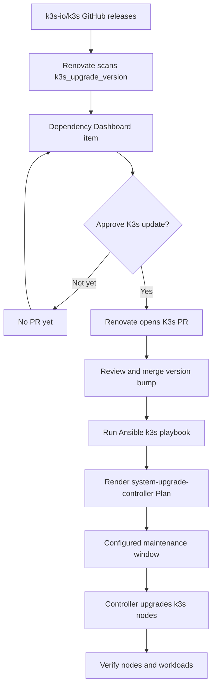

# Homelab

Personal platform engineering homelab running on Proxmox and Kubernetes.

## Tech stack

| Area              | Tools      | Notes                                    |
| ----------------- | ---------- | ---------------------------------------- |
| Virtualization    | Proxmox    | VM host for the homelab                  |
| Provisioning      | OpenTofu   | Declarative VM provisioning              |
| Configuration     | Ansible    | Host bootstrap and service configuration |
| Kubernetes        | k3s        | Lightweight Kubernetes cluster           |
| GitOps            | Flux       | CLI-first Kubernetes reconciliation      |
| Ingress           | Traefik    | Flux-managed ingress controller          |
| Secret management | SOPS + age | Encrypted Ansible and Kubernetes secrets |

## Layers

| Layer                  | Path                    | Purpose                                      |
| ---------------------- | ----------------------- | -------------------------------------------- |
| Provisioning           | `provisioning/opentofu` | Provision VMs on Proxmox                     |
| Configuration          | `provisioning/ansible`  | Bootstrap Linux hosts                        |
| Cluster entrypoints    | `clusters`              | Per-cluster Flux bootstrap and wiring        |
| Cluster infrastructure | `infrastructure`        | Kubernetes operators, controllers, and repos |
| Applications           | `apps`                  | User-facing Kubernetes workloads             |
| Documentation          | `docs`                  | Runbooks, IP table, architecture notes       |

## GitOps

Flux reconciles the Kubernetes cluster from this repository. It fits this homelab well because it has first-class SOPS + age support for encrypted secrets, is lightweight, works cleanly from the CLI, and models GitOps primitives as native Kubernetes CRDs. That makes it a good match for a platform-engineering workflow where cluster state should be declarative, inspectable, and automation-friendly.

## What's running

This homelab runs a small Proxmox-backed platform with a k3s cluster for
GitOps-managed workloads and a few dedicated VMs for services that are better
kept close to the LAN or their appliance OS.

| System            | Address          | Managed by        | Purpose                                |
| ----------------- | ---------------- | ----------------- | -------------------------------------- |
| Proxmox host      | `192.168.178.10` | Manual            | VM host for the homelab                |
| AdGuard Home VM   | `192.168.178.12` | OpenTofu, Ansible | Local DNS and LAN service discovery    |
| k3s server VM     | `192.168.178.13` | OpenTofu, Ansible | Kubernetes control-plane node          |
| k3s agent VM      | `192.168.178.14` | OpenTofu, Ansible | Kubernetes worker node                 |
| Home Assistant VM | `192.168.178.15` | Manual            | HAOS appliance VM for home automation  |
| nas-vm            | `192.168.178.16` | OpenTofu, Ansible | Samba NAS for backups and shared files |

## Service endpoints

These endpoints are local-only and are not exposed to the public internet.
Remote access currently goes through Tailscale into the home network.

| Service        | Access                                | Notes                                               |
| -------------- | ------------------------------------- | --------------------------------------------------- |
| Proxmox        | `https://pve.home.hgpe.dev`           | Off-cluster service routed through Traefik          |
| Traefik        | `https://traefik.home.hgpe.dev`       | Flux-managed Traefik dashboard                      |
| AdGuard Home   | `https://adguard.home.hgpe.dev`       | Local DNS                                           |
| Home Assistant | `https://homeassistant.home.hgpe.dev` | HAOS VM routed through Traefik                      |
| Paperless      | `https://paperless.home.hgpe.dev`     | Document management on k3s                          |
| NAS shares     | `smb://nasfiles@192.168.178.16`       | `Shared`, `TimeMachine`, and `HomeAssistantBackups` |

## Secret management

Secrets are committed as encrypted YAML with SOPS and age.

- `.sops.yaml` defines the age recipient used for `*.sops.yml` files.
- Kubernetes Secret manifests under `apps/` and `infrastructure/` encrypt only
  `data` and `stringData`, leaving Kubernetes object metadata readable.
- `provisioning/ansible/ansible.cfg` enables the `community.sops.sops` vars plugin.
- `provisioning/ansible/inventories/homelab/group_vars/all.sops.yml` stores encrypted inventory values such as Cloudflare, Tailscale, and k3s credentials.
- Ansible reads the local age identity from `~/.sops/age.txt`.

## Ingress

k3s packaged Traefik is disabled for the homelab cluster in
`provisioning/ansible/inventories/homelab/group_vars/k3s_servers.yml`.
Traefik is installed by Flux from `infrastructure/controllers/traefik` using the
Helm repository in `infrastructure/sources/traefik.yaml`.

Traefik is Flux-managed instead of k3s-managed so the ingress controller,
certificate resolver settings, dashboard route, file-provider routes, and
Cloudflare token Secret all live in the same GitOps layer. This avoids the old
split where k3s installed Traefik while Ansible customized it by writing a
`HelmChartConfig` into the k3s manifests directory.

See `docs/runbooks/install-traefik-with-flux.md` for install and verification
steps.

## K3s node networking

The k3s server and agent VMs disable IPv6 at the host level with the Ansible
`disable_ipv6` role because the guest OS can receive IPv6 addresses that are not
routable on the LAN. Host-level IPv6 disablement is not enough by itself: pods
can still receive AAAA DNS answers and attempt IPv6 paths.

AdGuard Home keeps k3s effectively IPv4-only at the DNS layer. For AAAA records
requested from the k3s nodes, AdGuard returns `NOERROR` with no IPv6 answer.
Other VMs and LAN devices can still receive AAAA records and use IPv6 normally.

See `docs/runbooks/disable-ipv6-on-k3s-vms.md` for the apply and verification
commands.

## Dependency updates

Renovate runs in-cluster from `apps/renovate`. The self-hosted Renovate runtime
configuration lives in `apps/renovate/configmap.yaml`, while repository-specific
update rules live in `renovate.json`.

Renovate tracks GitOps-managed application images, Flux Helm releases, and the
pinned k3s upgrade target in
`provisioning/ansible/roles/k3s_addons/defaults/main.yml`.

K3s upgrades are treated differently from normal app updates. Renovate surfaces
new K3s releases in the Dependency Dashboard and requires manual approval before
opening a PR. K3s PRs are labeled `k3s`, `cluster-upgrade`, and
`manual-ansible-required`.

K3s update flow:



Merging a K3s version PR does not upgrade the cluster by itself. Run the Ansible
k3s playbook to render the updated system-upgrade-controller Plan onto the k3s
server. The controller then performs the upgrade during the configured
maintenance window.

## Common commands

```sh
cd provisioning/opentofu/environments/homelab
tofu plan
tofu apply
```

```sh
cd provisioning/ansible
ansible-playbook playbooks/test-sops.yml
```
