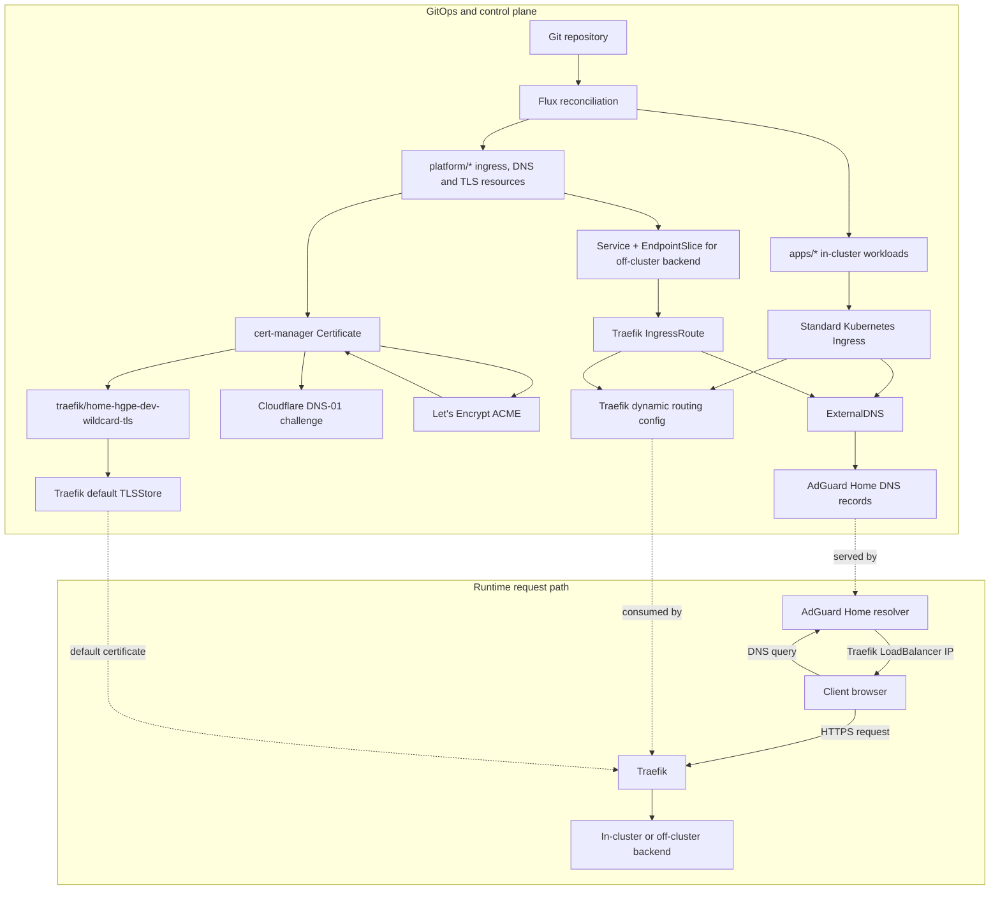

# Onboard an app or service

This runbook describes the normal GitOps flow for exposing a new service at
`*.home.hgpe.dev`.

The current ownership model is:

- Traefik routes HTTP(S) traffic.
- cert-manager owns Let's Encrypt certificates.
- ExternalDNS owns `home.hgpe.dev` DNS records in AdGuard Home.
- Flux reconciles the desired state from this repository.

Do not add Traefik ACME configuration or Traefik file-provider routes for new
services.

## Flow



## 1. Pick the route pattern

Use a standard Kubernetes `Ingress` for simple in-cluster HTTP apps.

Use a Traefik `IngressRoute` for off-cluster services, HTTPS backends,
self-signed backends, or routes that need Traefik-specific options such as
`ServersTransport`.

Recommended locations:

- In-cluster apps: `apps/<app-name>/`
- Off-cluster services: `platform/networking/`
- Cluster-wide TLS and issuer resources: `platform/cert-manager/`
- Traefik TLS defaults: `platform/traefik/`

The `platform-config` Flux Kustomization applies after infrastructure, so
resources that depend on cert-manager or Traefik CRDs belong under `platform/`.

## 2. Expose an in-cluster app

For an app running inside Kubernetes, create the app resources under
`apps/<app-name>/` and add that directory to `apps/kustomization.yaml`.

For a simple HTTP service, add a standard `Ingress`:

```yaml
apiVersion: networking.k8s.io/v1
kind: Ingress
metadata:
  name: example
  namespace: example
  annotations:
    traefik.ingress.kubernetes.io/router.entrypoints: websecure
    traefik.ingress.kubernetes.io/router.tls: 'true'
    external-dns.alpha.kubernetes.io/enabled: 'true'
    external-dns.alpha.kubernetes.io/hostname: example.home.hgpe.dev
spec:
  ingressClassName: traefik
  tls:
    - hosts:
        - example.home.hgpe.dev
  rules:
    - host: example.home.hgpe.dev
      http:
        paths:
          - path: /
            pathType: Prefix
            backend:
              service:
                name: example
                port:
                  number: 8080
```

Do not set `external-dns.alpha.kubernetes.io/target` on standard `Ingress`
resources. ExternalDNS discovers the Traefik LoadBalancer IPs from the Ingress
status.

The `tls` block enables HTTPS routing. Traefik serves the default wildcard
certificate from the `TLSStore`, so app namespaces do not need their own copy of
the wildcard TLS Secret.

## 3. Expose an off-cluster service

For a service outside Kubernetes, model it as a Kubernetes `Service` and
`EndpointSlice`, then expose it with Traefik `IngressRoute`.

```yaml
apiVersion: v1
kind: Service
metadata:
  name: example
  namespace: networking
spec:
  ports:
    - name: http
      port: 80
      targetPort: 80
---
apiVersion: discovery.k8s.io/v1
kind: EndpointSlice
metadata:
  name: example
  namespace: networking
  labels:
    kubernetes.io/service-name: example
addressType: IPv4
ports:
  - name: http
    protocol: TCP
    port: 80
endpoints:
  - addresses:
      - 192.168.178.50
---
apiVersion: traefik.io/v1alpha1
kind: IngressRoute
metadata:
  name: example
  namespace: networking
  annotations:
    external-dns.alpha.kubernetes.io/enabled: 'true'
    external-dns.alpha.kubernetes.io/hostname: example.home.hgpe.dev
    external-dns.alpha.kubernetes.io/target: 192.168.178.13,192.168.178.14
spec:
  entryPoints:
    - websecure
  routes:
    - match: Host(`example.home.hgpe.dev`)
      kind: Rule
      services:
        - name: example
          port: 80
          scheme: http
  tls: {}
```

Keep `external-dns.alpha.kubernetes.io/target` on `IngressRoute` resources.
ExternalDNS does not infer the Traefik LoadBalancer target from Traefik CRDs in
the same way it does for standard `Ingress`.

If the backend uses HTTPS with a self-signed certificate, add a
`ServersTransport` and reference it from the route:

```yaml
apiVersion: traefik.io/v1alpha1
kind: ServersTransport
metadata:
  name: example-transport
  namespace: networking
spec:
  insecureSkipVerify: true
```

```yaml
services:
  - name: example
    port: 443
    scheme: https
    serversTransport: example-transport
```

## 4. TLS and certificates

The wildcard certificate is managed centrally:

- Certificate: `platform/cert-manager/certificate.yaml`
- Issuers: `platform/cert-manager/issuers.yaml`
- TLS Secret: `traefik/home-hgpe-dev-wildcard-tls`
- Default TLSStore: `platform/traefik/tlsstore.yaml`

New apps and services should not create their own Let's Encrypt certificates for
`*.home.hgpe.dev`.

While the Certificate uses `letsencrypt-staging`, browsers will show the route
as not trusted even though Traefik is serving the expected certificate. Switch
`issuerRef.name` to `letsencrypt-prod` only when intentionally issuing a
production certificate.

## 5. DNS behavior

ExternalDNS watches:

- standard `Ingress`
- Traefik `IngressRoute`

Only annotated routes are processed because ExternalDNS uses:

```yaml
annotationFilter: external-dns.alpha.kubernetes.io/enabled=true
```

For `home.hgpe.dev` names, prefer ExternalDNS annotations over manual AdGuard
rewrites. Manual AdGuard rewrites are reserved for `.lan` names and are managed
by the Ansible AdGuard role defaults.

## 6. Validate before merging

Run the local render checks:

```sh
kubectl kustomize infrastructure
kubectl kustomize platform
kubectl kustomize apps
kubectl kustomize clusters/homelab
git diff --check
```

After the change is committed and pushed, reconcile Flux:

```sh
flux reconcile source git flux-system -n flux-system
flux reconcile kustomization infrastructure -n flux-system --with-source
flux reconcile kustomization platform-config -n flux-system --with-source
flux reconcile kustomization apps -n flux-system --with-source
```

Check routing, DNS, and TLS:

```sh
kubectl -n traefik get certificate,secret,tlsstore
kubectl -n networking get ingressroute,svc,endpointslice
kubectl -n paperless get ingress
dig example.home.hgpe.dev @192.168.178.12
curl -I https://example.home.hgpe.dev
```
