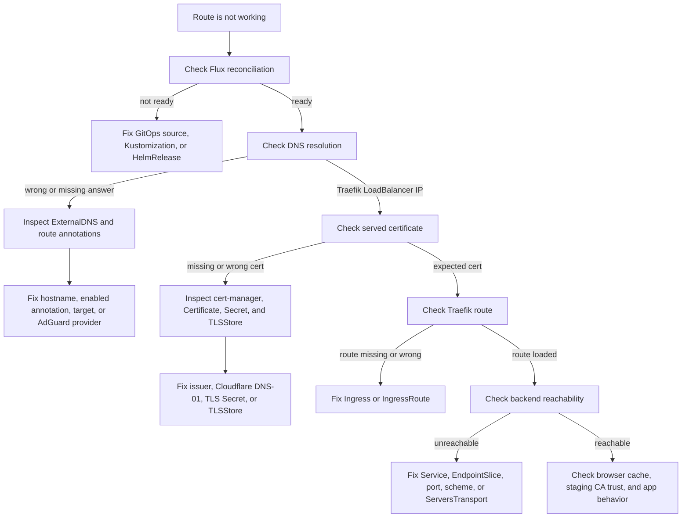

# Troubleshoot DNS, TLS, and Traefik routing

Use this runbook when a `*.home.hgpe.dev` route does not resolve, does not
serve the expected certificate, or reaches Traefik but not the backend.

The most useful habit is to debug in this order:

1. Flux applied the expected manifests.
2. ExternalDNS wrote the DNS record.
3. cert-manager issued the wildcard certificate.
4. Traefik loaded the route and TLSStore.
5. Traefik can reach the backend.

## Flow



## 1. Confirm Flux state

Check that the relevant reconciliation layers are ready:

```sh
flux get sources all -n flux-system
flux get kustomizations -n flux-system
flux get helmreleases -n flux-system
```

Expected:

- `infrastructure` is ready before `platform-config`.
- `platform-config` is ready before `apps`.
- Traefik, cert-manager, and ExternalDNS HelmReleases are ready.
- The cert-manager OCI source is ready.

If Flux is not ready, inspect the specific object:

```sh
flux describe kustomization platform-config -n flux-system
flux describe helmrelease traefik -n flux-system
flux describe source oci cert-manager -n flux-system
```

Local render checks are useful before pushing a fix:

```sh
kubectl kustomize infrastructure
kubectl kustomize platform
kubectl kustomize apps
kubectl kustomize clusters/homelab
```

## 2. Check DNS

Query AdGuard directly:

```sh
dig pve.home.hgpe.dev @192.168.178.12
```

Expected answer:

```text
192.168.178.13
192.168.178.14
```

For a standard Kubernetes `Ingress`, check annotations and status:

```sh
kubectl -n paperless get ingress paperless -o yaml
```

Expected:

- `external-dns.alpha.kubernetes.io/enabled: "true"`
- `external-dns.alpha.kubernetes.io/hostname: paperless.home.hgpe.dev`
- no explicit `external-dns.alpha.kubernetes.io/target`
- `status.loadBalancer.ingress` contains the Traefik LoadBalancer IPs

For a Traefik `IngressRoute`, check annotations:

```sh
kubectl -n networking get ingressroute pve -o yaml
```

Expected:

- `external-dns.alpha.kubernetes.io/enabled: "true"`
- `external-dns.alpha.kubernetes.io/hostname: pve.home.hgpe.dev`
- `external-dns.alpha.kubernetes.io/target: 192.168.178.13,192.168.178.14`

If DNS is wrong, inspect ExternalDNS:

```sh
kubectl -n external-dns get pods
kubectl -n external-dns logs deployment/external-dns --since=20m
kubectl -n external-dns get secret adguard-configuration
```

Common DNS causes:

- Missing `enabled=true` annotation.
- Wrong hostname.
- Missing `target` annotation on an `IngressRoute`.
- ExternalDNS is not watching the right source.
- AdGuard provider credentials are wrong.
- A stale manual AdGuard rewrite conflicts with the ExternalDNS record.

## 3. Check certificate issuance

Check the wildcard Certificate and issuer:

```sh
kubectl get clusterissuer
kubectl -n traefik get certificate home-hgpe-dev-wildcard
kubectl -n traefik describe certificate home-hgpe-dev-wildcard
kubectl -n traefik get secret home-hgpe-dev-wildcard-tls
```

Expected:

- `Certificate` has `Ready=True`.
- Secret `traefik/home-hgpe-dev-wildcard-tls` exists.
- Secret type is `kubernetes.io/tls`.

Check cert-manager logs if issuance is failing:

```sh
kubectl -n cert-manager logs deployment/cert-manager --since=30m
kubectl -n cert-manager logs deployment/cert-manager-webhook --since=30m
```

Common certificate causes:

- Cloudflare token is missing or lacks DNS edit permissions.
- DNS-01 challenge record was not created or propagated.
- `ClusterIssuer` is not ready.
- `Certificate` points at the wrong issuer.
- Let’s Encrypt production rate limits were hit.

Note: if `issuerRef.name` is `letsencrypt-staging`, browsers will show the
certificate as untrusted. That is expected. The certificate is still useful for
validating the routing and DNS flow.

## 4. Check what certificate Traefik serves

Inspect the certificate from a client on the LAN:

```sh
echo | openssl s_client \
  -connect pve.home.hgpe.dev:443 \
  -servername pve.home.hgpe.dev \
  -showcerts 2>/dev/null \
  | openssl x509 -noout -subject -issuer -dates -ext subjectAltName
```

Expected while staging is active:

- issuer contains `STAGING`
- SAN contains `DNS:*.home.hgpe.dev`
- dates match the cert-manager Certificate

Check the Traefik TLSStore:

```sh
kubectl -n traefik get tlsstore default -o yaml
kubectl -n traefik get secret home-hgpe-dev-wildcard-tls
kubectl -n traefik logs deployment/traefik --since=30m
```

Common TLS causes:

- `TLSStore/default` was created before the TLS Secret existed. This usually
  resolves after cert-manager creates the Secret and Traefik reloads it.
- Route does not enable TLS.
- Browser is showing an old TLS session or cached certificate details.
- Staging certificate is working but browser marks it untrusted.

## 5. Check Traefik route discovery

For standard `Ingress` routes:

```sh
kubectl -n paperless get ingress paperless -o yaml
```

Expected:

- `spec.ingressClassName: traefik`
- `traefik.ingress.kubernetes.io/router.entrypoints: websecure`
- `traefik.ingress.kubernetes.io/router.tls: "true"`
- no `traefik.ingress.kubernetes.io/router.tls.certresolver`

For `IngressRoute` routes:

```sh
kubectl -n networking get ingressroute pve -o yaml
```

Expected:

- `spec.entryPoints` includes `websecure`
- `spec.routes[].match` uses the expected hostname
- `spec.routes[].services[]` points to the expected Service and port
- `spec.tls: {}`

Check Traefik logs:

```sh
kubectl -n traefik logs deployment/traefik --since=30m
```

Common Traefik causes:

- `IngressRoute` is in the wrong namespace.
- `Service` name or port does not match.
- `serversTransport` name is wrong.
- Old `certresolver` annotations remain after Traefik ACME was removed.
- HelmRelease failed and Traefik is still running an older config.

## 6. Check backend reachability

For off-cluster services, confirm the Service and EndpointSlice:

```sh
kubectl -n networking get svc,endpointslice
kubectl -n networking get endpointslice pve -o yaml
```

Expected:

- EndpointSlice has the real off-cluster IP.
- Service port matches the backend port.
- IngressRoute service `scheme` matches the backend protocol.

Use a temporary curl pod if you need to test from inside the cluster:

```sh
kubectl -n networking run curl \
  --rm -it \
  --restart=Never \
  --image=curlimages/curl:8.11.1 \
  -- curl -vk https://pve:8006
```

For HTTP backends:

```sh
kubectl -n networking run curl \
  --rm -it \
  --restart=Never \
  --image=curlimages/curl:8.11.1 \
  -- curl -v http://adguard:80
```

Common backend causes:

- Wrong off-cluster IP.
- Wrong port.
- Backend expects HTTPS but route uses `scheme: http`.
- Backend has a self-signed certificate and needs `ServersTransport`.
- Firewall blocks cluster nodes from reaching the service.

## 7. Browser checks

If CLI checks pass but the browser still looks wrong:

- Open certificate details and confirm the issuer.
- If issuer contains `STAGING`, `Not Secure` is expected.
- Hard refresh or reopen the browser tab.
- Try another browser or `curl -vk https://<host>`.
- Check whether the app itself redirects to a different host or port.

## 8. Quick symptom map

| Symptom | First place to check |
| --- | --- |
| `dig` returns no record | ExternalDNS logs and route annotations |
| `dig` returns old IP | AdGuard records and stale manual rewrites |
| Browser shows staging CA | `Certificate` issuerRef is `letsencrypt-staging` |
| Browser shows Traefik default cert | TLSStore, TLS Secret, route TLS settings |
| Traefik returns 404 | Ingress or IngressRoute match rule |
| Traefik returns 502 | Service, EndpointSlice, port, scheme, backend reachability |
| HelmRelease not ready | Flux HelmRelease status and chart values schema |
